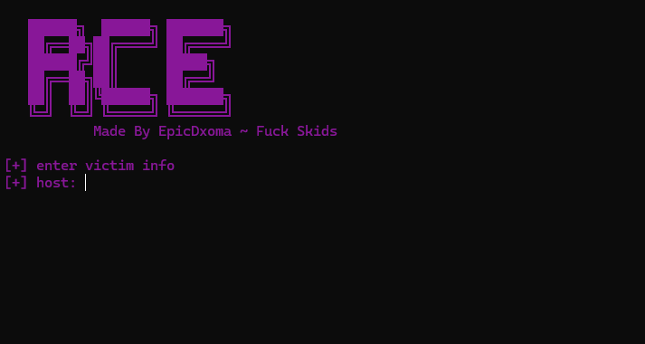

# RCE Generator

An advanced payload generation utility designed for penetration testers, security researchers, and ethical hackers to efficiently automate and streamline the creation of Remote Code Execution (RCE) exploits.



---

## Features

* **Multi-Platform Support:** Quickly generates clean, functional payloads for various environments including PHP, Python, PowerShell, Bash, and Netcat.
* **Interactive CLI Workflow:** Features a streamlined command-line interface that prompts for vital target parameters (Host/Port) and outputs production-ready scripts.
* **Firewall Resilience Testing:** Built-in basic encoding capabilities to assist researchers in evaluating Web Application Firewall (WAF) filtering and detection rules.
* **Lightweight & Fast:** Optimized terminal-based interface designed to execute efficiently without heavy dependencies.

---

## Requirements

Before running the tool, ensure you have the following installed:
* Python 3.x
* Any relevant standard dependencies

---

## Installation & Execution

To download and run the tool on your system, execute the following commands in your terminal:

```bash
# Clone the repository
git clone https://github.com/DxomaArabia/rce-generator.git

# Navigate into the project directory
cd rce-generator

# Execute the application
python main.py
